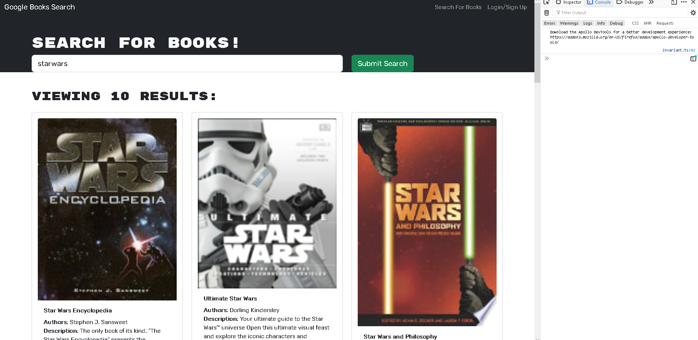

# Google Books App

## Description

### Motivation

To refactor an application in its Native RESTful format to a MERN stack framework. 

### Build

I built this product to allow users to discover books they may have an interest in. 

### Solve

It provides avid book readers, an easy and convenient way to query and discover new books.

### Learn

I learned the differences between these two frameworks. The main difference between a RESTful app and a MERN app is that a RESTful app is focused on building APIs, while a MERN app is focused on building full-stack web applications. RESTful apps are stateless and use HTTP requests to communicate with servers, while MERN apps use MongoDB, Express.js, React.js, and Node.js to build complex web applications.

## Table of Contents:

[1. Installation](#Installation)

[2. Usage](#Usage)

[3. License](#License)

[4. Contribution](#Contribution)

[5. Tests](#Tests)

[6. Questions](#Questions)
        
## Installation:

You can visit the website.

## Usage:

Create an account, search for books and save the books you have an interest in. 

## License:

## Contribution:

Anyone is free to contribute.

## Tests:

None

## Questions:

The source code of this project can be found on my Github repository at www.github.com/sotiriosc. Feel free to contact 
me any time regarding questions or recomendations. My email is chortogiannoss@gmail.com. Thank you for taking the time to review and use my app. 

        